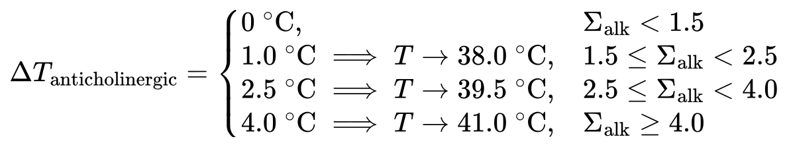
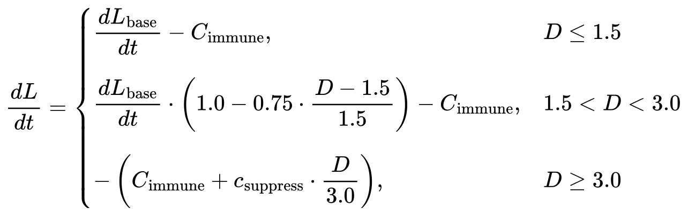

[English Version](SPOILER.md) | [中文版本](SPOILER_zh.md)

# 剧透 SPOILER

**Aliment（供养）** 是一个关于生理、疾病、药物与传染的模组。

这份文件是**玩法剧透**：所有机制、隐藏的数值门槛、配方、画面效果和指令都在这里。
喜欢自己摸索的玩家请就此打住——想自己发现"为什么喝完海水当场没事、后来却特别渴"、
"生汤到底哪里不对"，就不要往下看了。

相关文档：
- 生理与医学数值模型：[`PHYSIOLOGY.md`](PHYSIOLOGY.md)
- 技术架构与开发实现：[`TECHNICAL.md`](TECHNICAL.md)
- 资源生成与开发自检：[`tools/README.md`](tools/README.md)

---

## 30 秒版本

你**不会**因为吃坏东西立刻掉血。感染是一条慢曲线：病原体在体内越涨越快，
而免疫系统的战斗力**在中间那段最高**——炎症太低免疫罢工，太高则免疫风暴反过来伤害你。
你能做的是控制炎症（柳树皮汤里的水杨苷、地塞米松注射剂），把水、电解质、碘和体温
维持在各自的稳态里，并尽量别喝沼泽水、别徒手摸蝙蝠。

---

## 1. 全植物自然生成与生态条件总览

模组包含 8 种特色植物与真菌，全部通过 Fabric 动态群系修改注入主世界植被装饰阶段（`GenerationStep.Decoration.VEGETAL_DECORATION`），具备独立的自然分布规则、附着基底判定与采集机制：

| 植物 / 真菌 | 自然生成群系 | 生成概率 / 密度 | 附着基质与地貌判定条件 | 自然生成状态 | 采收机制与药用成分 |
| --- | --- | --- | --- | --- | --- |
| **垂柳**<br>`aliment:willow` | 所有河流群系<br>（`#minecraft:is_river`：河流、冻河等） | 稀有度过滤 1/2<br>（每个区块 50% 概率） | 岸边泥土/草方块；水深必须为 0（`max_water_depth: 0`，不插水里）；高度图 `OCEAN_FLOOR` | 完整垂柳/高垂柳<br>（垂挂柳藤） | 斧头剥皮获得柳树皮（生水杨苷 +1.1） |
| **曼陀罗**<br>`aliment:mandrake` | 平原、向日葵平原、沼泽、红树林沼泽 | 每次 1 株<br>（`count: 1`） | 正下方必须为**草方块**（`grass_block`）；高度图 `WORLD_SURFACE_WG` | 成熟期（`age: 3`）<br>（带花与果实） | 破坏获得 1–2 个果实（东莨菪碱 +1.0，阿托品 +0.1） |
| **橘黄裸伞**<br>`aliment:gymnopilus` | 黑森林、沼泽、红树林沼泽、针叶林、原始松木针叶林、原始云杉针叶林 | 每次 3 株<br>（`count: 3`） | 下方为主世界基底方块（`#minecraft:substrate_overworld`，泥土/各类原木）；高度图 `WORLD_SURFACE_WG`；**无黑暗限制** | 成熟单体真菌 | 徒手采集；生吃获裸盖菇素与醇各 +1.3（熟吃无致幻） |
| **麻黄**<br>`aliment:ephedra` | 沙漠、恶地、侵蚀恶地、疏林恶地、风蚀丘陵、热带草原、热带草原高原、风蚀热带草原 | 稀有度过滤 1/8<br>（每个区块 12.5% 概率） | 下方支持 4 类基质：沙子、红沙、陶瓦、草方块；高度图 `WORLD_SURFACE_WG` | 成熟期（`age: 3`） | **右键采收** 1–2 枝并退回阶段 1（提供麻黄碱 +0.5） |
| **黄连**<br>`aliment:coptis` | 主世界所有非寒冷群系<br>（基准温度 $\ge 0.2$ 且非寒冷青蛙群系） | 稀有度过滤 1/12<br>（每个区块约 8.3% 概率） | 正下方必须为**草方块**（`grass_block`）；高度图 `WORLD_SURFACE_WG` | 成熟期（`age: 3`） | 右键采收或破坏获得黄连（提供黄连素 +1.1） |
| **黄柏**<br>`aliment:phellodendron` | 主世界所有非寒冷群系<br>（基准温度 $\ge 0.2$ 且非寒冷青蛙群系） | 稀有度过滤 1/12<br>（每个区块约 8.3% 概率） | 正下方必须为**草方块**（`grass_block`）；高度图 `WORLD_SURFACE_WG` | 灌木成熟期（`age: 3`） | 右键采收或破坏获得黄柏树皮（提供黄连素 +0.6） |
| **甘草**<br>`aliment:licorice` | 主世界所有非寒冷群系<br>（基准温度 $\ge 0.2$ 且非寒冷青蛙群系） | 稀有度过滤 1/12<br>（每个区块约 8.3% 概率） | 正下方必须为**草方块**（`grass_block`）；高度图 `WORLD_SURFACE_WG` | 成熟期（`age: 3`） | 右键采收或破坏获得甘草根（提供甘草酸 +1.1） |
| **海藻**<br>`aliment:seaweed` | 所有海洋群系<br>（`#minecraft:is_ocean`：温带、暖水、冷水、深海、冻洋等） | 每次 4 株<br>（`count: 4`） | 必须完全浸没于水中（`matching_fluids: water`）；海底必须为**沙子或可疑的沙子**；高度图 `OCEAN_FLOOR_WG` | 成熟浸水态（`age: 3, waterlogged: true`） | **水下右键采收** 1–2 根海藻并退回阶段 1（提供碘 +0.20 µmol/L） |

---

## 2. 柳树生态与生成

### 生成特性
* **只在河边生成**：地物注入 `#minecraft:is_river`（河流、冻河）生物群系的植被装饰阶段（`VEGETAL_DECORATION`），且放置条件与原版平原树木一致（包含 `surface_water_depth_filter` 过滤），只会长在河岸土/草方块上，**绝不会插在水里**。
* **两种树形**：普通垂柳（树干高 5–7 格，垂坠树冠半径 3 格）与高垂柳（树干高 8–10 格）。树苗生长时按 **65% / 35%** 概率二选一。
* **向水倾斜生长**：采用自定义的倾斜树干生成器（`leaning_willow_trunk_placer`）。在树干周围 7 格范围内自动检测水面分布，自动向水源最密集的一侧逐级弯曲倾斜 1–4 格，呈现倒映河畔的自然姿态；若四周无水则直立生长。
* **垂柳藤条**：树叶下方挂有垂柳条（`willow_vines` 末端与 `willow_vines_plant` 中段），自然向下垂 1–3 格。藤条会随着时间缓慢向下生长，亦可用**骨粉催长**。
* **树苗特性**：可在泥土、草方块、耕地、砂土等常规基底上种植，**可用骨粉催熟**。柳树树叶**不结苹果**（移除苹果掉落表）。

---

## 3. 柳木方块与物品全清单

模组拥有独立的创造模式物品栏分类 **「供养 / Aliment」**（`itemGroup.aliment.main`），模组所有物品均收录在此。

| 物品 / 方块 ID | 中文名 | 详细说明 |
| --- | --- | --- |
| `aliment:willow_log` | 柳木原木 | 带有 `axis` 属性，斧头右键剥皮掉落树皮 |
| `aliment:willow_wood` | 柳木 | 全面树皮原木 |
| `aliment:stripped_willow_log` | 去皮柳木原木 | 剥皮后生成 |
| `aliment:stripped_willow_wood` | 去皮柳木 | 六面去皮 |
| `aliment:willow_planks` | 柳木木板 | 基础建材，由柳木原木分解 |
| `aliment:willow_leaves` | 柳树树叶 | 根据所在生物群系草木颜色动态染色，不掉落苹果 |
| `aliment:willow_sapling` | 柳树树苗 | 可用骨粉催熟长成柳树 |
| `aliment:potted_willow_sapling` | 柳树树苗盆栽 | 盆栽装饰方块 |
| `aliment:willow_vines` | 垂柳 | 悬挂在树冠底部的柳条末端（可骨粉催长） |
| `aliment:willow_vines_plant` | 垂柳茎 | 柳条中段生长躯干 |
| `aliment:willow_stairs` / `_slab` | 柳木楼梯 / 柳木台阶 | 标配建筑方块 |
| `aliment:willow_fence` / `_fence_gate` | 柳木栅栏 / 柳木栅栏门 | 标配庭院建材 |
| `aliment:willow_door` / `_trapdoor` | 柳木门 / 柳木活板门 | 专属木套件类型 |
| `aliment:willow_pressure_plate` / `_button` | 柳木压力板 / 柳木按钮 | 红石触发元件 |
| `aliment:willow_shelf` | 柳木架子 | 陈列架方块，挂载原版 `SHELF` 方块实体 |
| `aliment:willow_sign` / `_wall_sign` | 柳木告示牌 / 墙上告示牌 | 木质标牌 |
| `aliment:willow_hanging_sign` / `_wall_hanging_sign` | 柳木悬挂告示牌 / 墙上悬挂告示牌 | 悬挂标牌 |
| `aliment:willow_boat` | 柳木船 | 柳木制轻型载具，具备独立模型实体 |
| `aliment:willow_chest_boat` | 柳木运输船 | 携带储物箱的柳木船 |
| `aliment:willow_bark` | 柳树树皮 | 斧头右键柳木剥皮时掉落 |
| `aliment:willow_bark_pieces` | 柳树皮碎片 | 柳树皮放入砂轮研磨得到 |
| `aliment:willow_soup_cauldron` | 柳树皮汤炼药锅 | 盛放柳树皮药汤的炼药锅（含 `level` 水位及 `cooked` 生熟状态） |
| `aliment:raw_willow_bark_soup_bottle` | 生柳树皮汤（瓶装） | 药汤未煮熟时用玻璃瓶打出，有感染风险 |
| `aliment:raw_willow_bark_soup_bowl` | 生柳树皮汤（碗装） | 药汤未煮熟时用碗打出 |
| `aliment:willow_bark_soup_bottle` | 柳树皮汤（瓶装） | 药汤熬煮熟透后装瓶，安全的水杨苷药剂 |
| `aliment:willow_bark_soup_bowl` | 柳树皮汤（碗装） | 药汤煮熟后用碗盛出，兼具饱食度与药效 |

### 柳木相关合成表（16 个）
柳木木板、柳木（四面原木）、去皮柳木、楼梯、台阶、栅栏、栅栏门、门、活板门、压力板、按钮、告示牌、悬挂告示牌、架子、船、运输船。所有合成比例与耗材均与原版标准木质套装完全一致。

---

## 3. 树皮 → 柳树皮汤流程

```
柳木原木 / 柳木 ──斧头右键剥皮──> 去皮原木/木 + 柳树树皮 ×1
柳树树皮 ──砂轮──> 柳树皮碎片 ×2
柳树皮碎片 ──右键水炼药锅──> 生柳树皮汤炼药锅（水量继承原水炼药锅）
                                │
                           下方放置点燃的篝火 / 灵魂篝火，持续加热 60 秒
                                ▼
                           柳树皮汤炼药锅（煮熟，汤色显著变深）
                                │
                   玻璃瓶右键 ──> 瓶装（饮用，返还玻璃瓶）
                   碗右键     ──> 碗装（食用，返还碗）
```

* **炼药锅机制**：
  - 炼药锅内水级数（1～3 级）对应可盛出的汤剂份数。
  - 每盛出一份，水位降低 1 级；全部盛完后变回普通的空炼药锅。
  - 破坏有汤的炼药锅仅掉落普通的空炼药锅。
  - 加热期间若中途熄灭或移开篝火，熬煮倒计时暂停且不会变熟；重新点燃后重新计时 60 秒。
* **生汤与熟汤对比**：
  - 生汤色泽浑浊浅淡，含悬浮树皮纤维；熟汤色泽深浓清亮。
  - 盛装进玻璃瓶或碗中后，两者的显示名称均对应为“生柳树皮汤”与“柳树皮汤”。

| 汤品类别 | 饥饿度 | 饱和度 | 附加生理与药理效果 |
| --- | --- | --- | --- |
| **生柳树皮汤**（瓶装/碗装，含咸味版） | 1 点 | 1 点 | **25% 概率反胃** 20 秒、**15% 概率饥饿** 20 秒、**30% 概率细菌感染**、+1.1 水杨苷、+15 水分 |
| **柳树皮汤**（瓶装/碗装，含咸味版） | 1 点 | 2 点 | **安全无副作用**、+1.1 水杨苷（抗炎退烧）、+15 水分 |

> **药效提示**：生汤中残留有未经煮沸的杂菌与刺激性树脂，因此极易引发反胃和继发性细菌感染；熬煮熟透后所有病原体被灭活，是求生初期最关键的水杨苷（解热镇痛药）来源。

## 4. 盐业链

```
岩盐矿（地下 y=20–90，需要石镐，掉落自身）
   └─砂轮─> 粗盐 ×9 ──砂轮──> 粗盐粉
                                └─右键水炼药锅─> 粗盐水炼药锅
                                                    │ 下方放篝火 / 灵魂篝火
                                                    │ 每 20 秒浓缩一级，共 3 级
                                                    ▼ 烧干
                                                盐粉 ×1（锅变空）

粗盐 / 盐粉 + 水 / 蘑菇煲 / 柳树皮汤 / 生柳树皮汤
   ──> 粗盐水 / 盐水、粗盐蘑菇煲 / 盐蘑菇煲、
       粗盐柳树皮汤 / 盐柳树皮汤、粗盐生柳树皮汤 / 盐生柳树皮汤
```

* **搅拌棒**（上下各一根木棍）右键粗盐水炼药锅，**立刻推进一级**蒸发，用 16 次会坏。
* 粗盐带着岩盐里的杂质：除了钠和氯，还补一点**镁和钙**；精盐几乎纯氯化钠，更容易把钠推高。
* 所有带盐饮品都**补水并补钠**，粗盐版本额外补镁钙。

## 5. 砂轮

| 放进去 ×1 | 出来 |
| --- | --- |
| 柳树树皮 | 柳树皮碎片 ×2 |
| 岩盐矿 | 粗盐 ×9 |
| 粗盐 | 粗盐粉 ×1 |

这些都能直接放进**原版砂轮界面**，但**一次只收一个**（放整堆会被结果槽吞掉）。
想批量处理就用**潜行 + 右键**砂轮：不开界面、直接转化一个，可以连点。

## 6. 水与口渴

* 左侧生命值上方有一条 **10 格口渴条**，每格 10 点水。
* 舒适范围 **30 – 100**，上限 200，健康时是 80。
* 每份饮品补 **15 点水**（水、药水、蘑菇煲、柳树皮汤、所有带盐饮品……）。
* **不出汗时 5 个游戏日完全耗尽（100 → 0）。**
* **发烧会大幅加速失水**：发热 39 °C 时 3.5 游戏日耗尽，高热 40 °C 时 2.0 游戏日耗尽。
* 超过 100 算**过水**：虚弱、挖矿变慢、额外掉饱食度，肾脏还会顺手把电解质冲掉；
  超过 150 再加**反胃**。

**在什么地方取水，得到的水不一样**：河流等普通水源仍是原版水瓶，**沼泽**得到沼泽水瓶，
**海洋**得到海水瓶。

| 水 | 喝下去会怎样 |
| --- | --- |
| 沼泽水瓶（含粗盐 / 盐版本） | 30% 细菌感染、35% 反胃、5% 中毒，各持续 30 秒 |
| **海水瓶**（含粗盐 / 盐版本） | **当场什么都不会发生**——它只是**高渗水**：一瓶就把钠顶过安全线，之后由身体自己算账（剧渴、加速失水，再往下才是虚弱） |

## 7. 电解质与碘

这一套用的是**真实单位**：电解质是 **mmol/L**，碘是 **µmol/L**，每一格用的是临床上的
**参考范围**。四个门槛都双向生效——缺和多都是病：

| 矿物质 | 正常 | 参考范围 | 单位 |
| --- | --- | --- | --- |
| 钠 | 140 | **135 – 145** | mmol/L |
| 钾 | 4.2 | **3.5 – 5.0** | mmol/L |
| 镁 | 0.85 | **0.70 – 1.00** | mmol/L |
| 氯 | 101 | **96 – 106** | mmol/L |
| 钙 | 2.35 | **2.10 – 2.60** | mmol/L |
| 碘 | 0.50 | **0.40 – 0.80** | µmol/L |

身体会自己把每一项拉回正常值，所以**放任不管也不会一路滑到极端**——**只有碘例外**：

* 五项电解质稳定在正常值。
* **碘没有回补，只有流失**：一份储备（正常 0.50 到硬下限 0.05）**三个游戏日整掉光**，
  之后一直停在下限。只能靠吃补：
  * **原版海带**：`+0.10 µmol/L`
  * **原版干海带**：`+0.20 µmol/L`
  * **海藻**：`+0.20 µmol/L`（水生可再生作物，水下右键重复采收）
  * **熟海藻**：`+0.25 µmol/L`（熔炉/烟熏炉/营火烹制，充饥 3 / 饱食 0.6）
  * **海藻碘盐**：`+0.40 µmol/L`（碎海藻 + 精盐粉合成，额外补充 `+1.5 mmol/L` 钠和氯）
  每天固定掉 0.15，所以**日常一天一份干海带或生海藻刚好抵消流失**。
  掉光之后是重度甲减：0.05 远低于重度线 0.20，而且甲状腺会把体温设定点往下拉 0.8 °C（伴随虚弱、挖掘疲劳与严重缓慢）。
  一场高烧（出汗把碘带走）会明显加快这个过程。
* **猛喝水最先被冲掉的是钠**，然后是氯，镁和钙掉得最慢。

**因为单位是真的，"喝盐水"这件事也就有了真实的后果**：一份粗盐 / 海水制品让钠 +3.0，
精盐 +3.5，而参考上限是 145。

> **喝一份：140 → 143，还在范围内；喝两份：→ 146~147，越过参考范围，开始口渴。**

| 矿物质 | 重度不足 | 轻度不足 | 轻度过量 | 重度过量 |
| --- | --- | --- | --- | --- |
| 钠 | 反胃 + 缓慢 | 虚弱 | 饥饿（剧渴） | 饥饿 + 虚弱 |
| 钾 | 虚弱、挖掘疲劳 | 虚弱 | 虚弱 | 缓慢、心律不齐（掉血） |
| 镁 | 虚弱 + 缓慢 | 虚弱 | 缓慢 | 缓慢 + 虚弱 |
| 氯 | 反胃 | 虚弱 | 饥饿 | 饥饿 + 反胃 |
| 钙 | 缓慢 + 虚弱 | 虚弱 | 缓慢 | 缓慢 + 虚弱 |
| 碘 | 缓慢、虚弱、挖掘疲劳 | 虚弱 + 缓慢 + 饥饿 | 饥饿 + 反胃 | 再加虚弱 |
| 维生素C | 挖掘疲劳 + 虚弱 | 挖掘疲劳 | 无（安全排出） | 无（安全排出） |

## 8. 免疫系统

炎症指数由五种介质加权而成，安静时正好落在安全区中点：

| 介质 | 管什么 | 主要被谁压制 |
| --- | --- | --- |
| 组胺 | 血管扩张、瘙痒、肿胀 | 两种药都略有效 |
| 前列腺素 | 疼痛、**发热** | **水杨苷** |
| 白三烯 | 支气管收缩、黏液 | **地塞米松** |
| 细胞因子 | 全身发热、风暴的主驱动 | **地塞米松**（最强） |
| 缓激肽 | 疼痛、血管扩张 | 水杨苷 |

规则很短：

* **炎症太低**（12 以下）→ 免疫罢工，感染反而失控，而且**这条路上你会凭空被感染**（见下）；
* **炎症太高**（75 以上）→ 免疫风暴，同样压不住病原，还反过来伤害你；
* 中间那段才是免疫力最高的带子，也是你要维持的。

药物能压掉绝大部分炎症反应，但**过量会把平时的炎症水平一起压下去**——
那等于自己制造免疫抑制，感染会跑得更快。

## 9. 感染来源

一共三条路，全都是"传染"，没有一条是运气：

| 来源 | 病原体 | 概率 | 一次加多少 |
| --- | --- | --- | --- |
| 生肉（牛 / 猪 / 鸡 / 羊 / 兔 / 鳕 / 鲑 / 热带鱼）、腐肉、毒马铃薯 | 细菌 | **30%** | +6 |
| 生柳树皮汤（含带盐版） | 细菌 | **30%** | +6 |
| **任何生物**走到 2 格以内 | 病毒 | **5% / 秒** | +5 |
| **免疫抑制时**（炎症 ≤ 12）凭空 | 细菌 | **15% / 秒** | **随机 +4 ~ +12** |

* 接触判定看的是**任何生物**——牛、狼、村民、蝙蝠都算。每秒掷一次，
  所以在一群牛里站十秒，几乎必然中招。
* **免疫抑制是唯一一条不需要外因的路**：身体自己的菌群就能进来，掷骰间隔同样是一秒。
  这也是为什么**把炎症压太低会把自己害死**——它和下面的重度感染伤害是同一套连锁。
* **重度感染（载量 $\ge 60.0$）会直接扣血**：魔法伤害，每两秒结算一次：

  

  护甲无法减免。载量 60 时每 10 秒半颗心，载量 100 时每 10 秒一颗心。这是整个模组里**唯一一个不需要怪物就能杀死你的症状**。

食物是在**真正咽下去的那一刻**判定的。

## 10. 药物

| 药物 | 从哪来 | 一次多少 | 多久代谢完 | 代谢速率 |
| --- | --- | --- | --- | --- |
| 水杨苷 | 柳树皮汤（生熟都算） | +1.1 | **3 个游戏日** | $\frac{d[\text{Salicin}]}{dt} = - \frac{3.0}{72000} \approx -4.167 \times 10^{-5}\text{ / tick}$ |
| 地塞米松 | 注射剂，右键注射 | +1.2 | **2 个游戏日** | $\frac{d[\text{Dex}]}{dt} = - \frac{2.0}{48000} \approx -4.167 \times 10^{-5}\text{ / tick}$ |

水杨苷是 COX 抑制剂，所以它**同时是退烧药**——发烧走的正是前列腺素。
地塞米松压细胞因子的能力明显强于水杨苷，但也更容易把炎症压过头。
**注意**：水杨苷与地塞米松**不直接消灭病原体**，而是通过压低炎症来平息免疫反应；过量会导致免疫抑制，反而使感染失控生长到 55 以上。

这两样东西**不用等自己做出来**：村庄的箱子和掠夺者前哨站的箱子里就有——

| 箱子 | 地塞米松注射液 | 柳树皮汤（碗） |
| --- | --- | --- |
| 村庄（全部 14 种箱子） | **3%** | **35%** |
| 掠夺者前哨站 | **3%** | **35%** |

两个概率各自独立掷，所以一个箱子理论上可能两样都有。箱子本身的原版战利品一件不少，
模组只是往表里各加了一个池子。汤是入门治疗，所以给得很勤；注射液不能合成，所以一直是稀罕物。

## 11. 体温

| 状态 | 体温 |
| --- | --- |
| 正常 | **37.0 °C** |
| 舒适区 | 36.0 – 38.5（什么都不发生） |
| 发烧 / 超高热 | **≥ 38.5** / **≥ 40.0** |
| 轻度 / 重度失温 | ≤ 36.0 / ≤ 35.0 |

体温由四件事决定：**感染带来的发热**、**注射的热原**（测试用）、**甲状腺**（碘）、
**环境**。环境只有一部分能压过体温调节：

| 环境 | 影响 |
| --- | --- |
| 温和的生物群系、沙漠 | 基本无感（沙漠只让体温升到 37 出头） |
| 雪原 | 让体温落到 36.6 左右，还不会有症状 |
| 雪地里泡水 | 降到 35.1 左右：**轻度失温** |
| 埋在细雪里（再叠加泡水） | 降到 32.8 左右：**重度失温** |
| 着火 | 38.2 左右，还够不上发烧线 |
| 岩浆 | 39.4 左右：**发烧**，画面边缘开始泛红扭曲 |

> **38.0 度是"不吃药也能到"的温度**（炎热环境 + 甲状腺偏热），所以发烧档从 **38.5**
> 才开始——否则你会觉得"我明明没病，屏幕却在晃"。

| 状态 | 表现 |
| --- | --- |
| 发烧 38.5 – 40.0 | 虚弱 + 挖掘疲劳（温度越高越重），画面边缘**泛红 + 扭曲** |
| 超高热 ≥ 40.0 | 上面全部保留，**再加动态模糊** |
| 失温 ≤ 36.0 / ≤ 35.0 | 虚弱 + 挖掘疲劳 **+ 缓慢**，画面边缘**冷颤 + 泛蓝** |

发烧出汗会同时带走水和盐，烧得越久越明显。

## 12. 画面效果

不是屏幕上的贴图，而是真正的全屏滤镜：**只在画面边缘**扭曲和偏色，
**正中央——准星和你真正在看的东西——保持完全清晰**。

| 效果 | 什么时候出现 | 你会看到 |
| --- | --- | --- |
| 热浪扭曲 | 体温 ≥ 38.5 | 画面边缘波纹状扭动，并泛红 |
| 动态模糊 | 体温 ≥ 40.0 | 上面全部保留，再加上镜头一动就拖尾的模糊（静止时依然锐利） |
| 冷颤 | 体温 ≤ 36.0 | 更慢、偏垂直的抖动，并泛蓝 |

如果画面没有任何变化，多半是客户端没能加载滤镜——日志里会有一行提示，
而虚弱、挖掘疲劳这些身体上的效果照常生效。

## 13. 镜头抖动

每 **15 秒**掷一次，命中就抖一下（大约 1 秒）。**抖动的每一个来源都必须同时给你一个效果图标**
（虚弱 / 反胃 / 饥饿……），否则你根本没有线索知道自己在晃什么：

| 来源 | 概率 |
| --- | --- |
| 正在生病（有症状） | 20%，免疫风暴翻倍 |
| 体温每偏离舒适区一档 | +15%，幅度也更大 |
| 镁偏低 | +15% |
| 钙严重偏低 | +20%，幅度也更大 |
| 碘过量（心悸） | +10% |
| 严重过水（这时已经有反胃图标） | +10% |

所以 **38 °C 以下不抖，"口渴条满"程度的过水也不抖**，最多到 85%。

## 14. 指令

```
/aliment status                 查看自己身上全部数据
/aliment fever [温度]           测试用：诱发发烧或低温（默认 39.5，范围 31–42），需要 OP
/aliment cure                   一键恢复健康并清掉画面效果，需要 OP
/aliment set <字段> <数值>      直接改数值，需要 OP（字段名用 Tab 补全）
```

`/aliment fever` **不直接改体温**：它给身体注入一份"热原"，让这次发烧的**峰值**正好落在
你要的温度上，大约两分钟烧到位、一个游戏日内退干净。命令回显会告诉你这次会触发哪一层
画面效果，以及怎么立刻停掉。

```mcfunction
/aliment fever          # 39.5 °C：画面边缘泛红 + 扭曲
/aliment fever 41       # 超高热：再加动态模糊
/aliment fever 34       # 低温症：冷颤 + 缓慢
/aliment cure           # 一切归零，画面效果当场消失
```

## 15. 曼陀罗

一种野生草本植物，四个生长阶段，**种在土里而不是耕地上**。

### 自然生成群系与环境判定
* **分布生物群系**：`minecraft:plains`（平原）、`minecraft:sunflower_plains`（向日葵平原）、`minecraft:swamp`（沼泽）、`minecraft:mangrove_swamp`（红树林沼泽）。
* **生成阶段**：植被装饰阶段（`GenerationStep.Decoration.VEGETAL_DECORATION`）。
* **放置规则与频率**：每个符合条件的区块尝试放置 1 株（`count: 1`, `in_square`），高度图采用地表基准 `WORLD_SURFACE_WG`。
* **附着基质断言**：自身所在位置必须为空气（`#minecraft:air`），正下方必须为**草方块**（`minecraft:grass_block`）。
* **初生状态**：自然生成时直接呈现为**成熟植株**（`age: 3`），草丛上方顶着白色花朵，侧边垂挂成熟绿色曼陀罗果实。

### 种植与采收
* **人工种植**：种子可撒在**草方块、泥土、粗泥、扎根泥土、泥、苔藓块**上，耕地亦可兼容；随机刻生长（光照等级 $\ge 9$ 时有 1/8 概率推进），**骨粉每次催熟一个阶段**（共 3 次催熟至完全成熟）。
* **收获规则**：只有**阶段 4（完全成熟）**破坏时才会掉落 **1–2 个曼陀罗果实**（附魔时运增加掉落数量）；前三个未成熟阶段破坏**不会掉落任何物品**。
* **种子繁殖**：在工作台或背包合成栏中，**1 个曼陀罗果实 $\to$ 2 颗曼陀罗种子**，可实现指数级扩种。

### 吃曼陀罗：东莨菪碱与阿托品

果实和种子**都能吃**（饱食时也能吃，右键空处即可；对着方块右键还是种下去）。它们带进来
两个数据，各自上限 **5.0**，**一个游戏日线性代谢干净**：


| 吃的东西 | 东莨菪碱 ($S_{\text{scop}}$) | 阿托品 ($A_{\text{atro}}$) |
| --- | --- | --- |
| 曼陀罗果实 | **+1.0** | **+0.1** |
| 曼陀罗种子 | **+0.75** | **+0.1** |

两者之和 $\Sigma_{\text{alk}} = S_{\text{scop}} + A_{\text{atro}}$ 超过 **1.5** 就开始**体温升高**，分三档（这是设定点上移，不是前列腺素发烧，**水杨苷退不掉**）：



另外，当满足 $S_{\text{scop}} \ge 2.3 \lor A_{\text{atro}} \ge 2.3 \lor \Sigma_{\text{alk}} \ge 2.7$ 时，触发**视觉模糊：雾收缩到 8 格**——
屏幕整体发糊，八格之外的方块全部糊进雾里。它和高温症状**互相独立、可以叠加**：
发烧的泛红扭曲和药物模糊会同时挂在屏幕上。

所以一颗果实（1.1）几乎没事，两颗（2.1）开始烧、三颗（3.1）同时烧又瞎。
想快点体验：`/aliment set scopolamine 3`。

## 16. 橘黄裸伞

一株长在阴湿朽木环境里的锈色蘑菇，模组的第二种致幻物。

### 自然生成群系与环境判定
* **分布生物群系**：`minecraft:dark_forest`（黑森林）、`minecraft:swamp`（沼泽）、`minecraft:mangrove_swamp`（红树林沼泽）、`minecraft:taiga`（针叶林）、`minecraft:old_growth_pine_taiga`（原始松木针叶林）、`minecraft:old_growth_spruce_taiga`（原始云杉针叶林）。
* **生成阶段**：植被装饰阶段（`GenerationStep.Decoration.VEGETAL_DECORATION`）。
* **放置规则与频率**：每个符合条件的区块尝试放置 3 株（`count: 3`, `in_square`），属于相对高密度的集群真菌；高度图采用 `WORLD_SURFACE_WG`。
* **附着基质断言**：自身位置必须为空气（`#minecraft:air`），正下方必须为主世界地表基底方块（`#minecraft:substrate_overworld`，支持泥土、草方块以及原木等各类木质基底）。
* **种植与光照突破**：作为木腐菌，它**完全打破了原版蘑菇的黑暗度限制**（无需光照 $\le 12$），可在开阔林地及阳光直射处自然生存与播种。

### 食用与代谢
* **生吃**：右击即食，一次拿到 **1.3 裸盖菇素 + 1.3 裸盖菇素醇**，3 饱食度 / 4 饱和度。
* **熟吃**：放进**熔炉、烟熏炉或篝火**都能烤（时间和生肉完全一样：熔炉/烟熏炉 200 刻、
  篝火 600 刻）得到**熟橘黄裸伞**：**4 饱食度 / 5 饱和度**，而且**什么物质都没有**——
  把致幻成分全烤没了。所以"想吃饱"和"想飞"是两件事。

### 两个指标怎么走

| 数据 | 作用 | 代谢 |
| --- | --- | --- |
| 裸盖菇素 psilocybin | **本身毫无效果**（前药） | 半游戏日内一比一变成裸盖菇素醇 |
| 裸盖菇素醇 psilocin | 视觉四阶段 + 体温 | **固定 1.3 / 游戏日**（吃多少都是这个速度） |

* **前药转化与零级代谢动力学**：

  ![\frac{d[\text{Psilocybin}]}{dt} = - \min\left([\text{Psilocybin}], \frac{1.3}{12](maths/math_0f3da0456f03.png)

  ![\frac{d[\text{Psilocin}]}{dt} = \min\left([\text{Psilocybin}], \frac{1.3}{12000}](maths/math_d346b4d8c7ef.png)

一颗蘑菇总计 2.6，正好**两天**清完；五颗（6.5/6.5）总计 13，就是**十天**。
因为代谢是固定速率，吃得多不是"多飘一会儿"，是**线性变长**。

有意思的推论：裸盖菇素单独吃**永远不会让你飞**——它变成裸盖菇素醇的速度，正好等于后者被清掉的
速度，所以两者抵消，只会维持在一个很低的水平。生蘑菇的"快感"来自它同时给的那份**直接的**
裸盖菇素醇，而前药的作用是**把时长翻倍**。

### 视觉四阶段（`/aliment set psilocin 6` 可以直接看）

| 裸盖菇素醇 | 屏幕 |
| --- | --- |
| $[\text{Psilocin}] > 1.2$ | 方块边缘**朝随机方向拉出彩色线条**（不是给边缘描一圈色，而是从边缘射出去的短线） |
| $[\text{Psilocin}] > 1.7$ | 方块**染上随机亮色**（保留明暗，画面还是清楚的）+ 一层**全屏彩色噪点** |
| $[\text{Psilocin}] > 2.5$ | 全屏**轻度扭曲** |
| $[\text{Psilocin}] > 5.0$ | **剧烈扭曲** + 体温开始爬升（最高 39 °C） |
| $[\text{Psilocin}] \ge 7.0$ | 体温可到 41 °C |

四阶段是**包含**关系（第 4 阶段照样有彩线和染色，只是更猛），并且和高温、曼陀罗的模糊
**全部可以叠加**。阈值是**严格大于**：正好 1.2 还是没事。

## 17. 创造模式与死亡

* **创造模式整套系统停摆。** 模型不推进（病原体不长不清、体温不走、药物不代谢）、
  不挂任何效果、不扣血、不算挖掘惩罚、也不给饱食度倍率；已经挂在屏幕上的发热扭曲 /
  动态模糊 / 冷抖动当 tick 就撤掉，镜头抖动随之停住。吃喝和注射同样进不去身体。
  这是**冻结**不是治愈：带着感染进创造，回到生存还带着它。
* **死亡重置身体。** 复活的是新身体——炎症回到安静值、没有病原体、体温 37、水量 80、
  碘回到正常值。死亡是唯一能把模型整个丢掉的办法，所以拖着重度感染回床睡觉是有用的。

## 18. 容易踩的坑

1. **海水不是脏水。** 喝下去当场没事，代价是那一大笔钠（两瓶就越过参考范围）。
2. **口渴条看不出过水。** 100 和 200 都画成十格满；看到虚弱图标才知道。
3. **生柳树皮汤是感染源**，煮熟不是——那 60 秒是值得等的。
4. **碘三天掉光，而且身体不会留住它。** 一天一份海带不够、两份刚好；不吃就会一路走到
   重度甲减，连带体温设定点下移。反过来吃多了也存不住，多出来的部分同样三天排空。
5. **水杨苷既是抗炎药也是退烧药**：它压前列腺素，所以烧会退。
6. **过量用药比感染更危险**：炎症被压到 12 以下是免疫抑制，而免疫抑制会**每秒 15% 凭空
   给你一个随机细菌感染**，载量堆到 60 以上就开始**直接掉血**——这是唯一一条能自己把自己
   杀死的路。
7. **别贴着一群牛站着。** 任何生物靠近 2 格内，每秒 5% 概率传病毒；贴太久迟早中招。
8. 柳树**不结苹果**。
9. 生病、发烧、过水、缺矿物质都会让你**抖镜头**，而每一种都能在效果栏里看到原因。

## 19. 成就系统

模组拥有独立的进度标签页（以获得柳树皮作为根成就展开）：

| 成就名称 | 描述 | 类型 | 触发条件 |
| --- | --- | --- | --- |
| **古老的抗炎** | 获得一块柳树皮 | 普通（根成就） | 获得柳树皮（砍树剥皮或拾取） |
| **只是粗盐** | 碾碎一块岩盐矿 | 普通 | 在砂轮上碾碎一块岩盐矿（潜行右键或在砂轮界面研磨） |
| **碎了又碎** | 碾碎一块粗盐 | 普通 | 在砂轮上碾碎一块粗盐得到粗盐粉 |
| **精盐** | 不含杂质的精品食盐 | 普通 | 获得盐粉（水炼药锅熬干析出精品盐） |
| **即便是危险的** | 品尝一口曼陀罗的味道 | 普通 | 吃下曼陀罗果实或曼陀罗种子 |
| **迷幻的世界** | 吃下一口橘黄伞菇 | 普通 | 吃下橘黄伞菇（橘黄裸伞） |
| **超高热** | 核心体温超过40摄氏度 | 挑战 | 核心体温超过 40.0 °C（严重感染、曼陀罗或大量裸菇素等引发） |

## 20. 酿酒与蒸馏系统

模组提供了基于真实化学/微生物原理的发酵与蒸馏设备：

### 1. 玻璃发酵罐（Glass Fermentation Tank）
- **合成方式**：四周围一圈玻璃，第一行第二格放置任意木板。
- **运作机制**：
  - 拥有 3 个水量等级，支持使用水桶（填满 3 级）或水瓶（每次加 1 级）加水。
  - 向有水的发酵罐中投入**糖**（消耗 1 个）与**酿酒酵母**（消耗 1 个），发酵罐进入发酵状态（产生气泡粒子）。
  - 发酵需持续 **45 秒**（900 ticks），发酵完成后罐内液体转化为 **7% 乙醇浓度** 的发酵酒液。
  - 手持**玻璃瓶**右键发酵罐，可装出名为**“酒”**的物品，其 NBT 中记录了 `concentration: 0.07`，物品提示栏显示“酒精浓度: 7%”。

### 2. 酿酒酵母（Brewer's Yeast）
- **合成方式**：无定形合成，小麦 + 糖 + 棕色蘑菇。
- 用于投入发酵罐启动发酵。

### 3. 玻璃冷凝管（Glass Condenser Pipe）与蒸馏机制
- **合成方式**：工作台第 1 排与第 3 排全放玻璃，中间整排留空。
- **管道形态**：
  - 单根冷凝管竖直放置时，其出口方向**朝上**。
  - 当横向与其它冷凝管相连时，出口方向自动弯折**朝下**。
- **营火蒸馏系统**：
  - 在发酵罐下方放置点燃的**营火**或**灵魂营火**进行加热。
  - 当发酵罐内有发酵酒液时，每 **30 秒**（600 ticks）蒸发出 1 级酒液：
    - **标准冷凝连接**：在发酵罐正上方放置一根竖直冷凝管，在其水平侧边再放一根横向冷凝管（出口朝下），横向冷凝管的正下方放置**炼药锅**。蒸馏出的酒精液体将凝结并滴入炼药锅，转化为**酒精炼药锅**（共 3 级）。使用玻璃瓶右键酒精炼药锅可盛出**40% 乙醇浓度**的高纯度“酒”（NBT 记录 `concentration: 0.40`，提示显示“酒精浓度: 40%”）。
    - **未连接或出口朝上**：若未安装冷凝管，或仅有单根出口朝上的冷凝管（或横管下方无收集容器），蒸馏出的酒精液体直接挥发到空气中（每 30 秒白白浪费 1 级液体，伴随蒸汽白烟与熄火嘶嘶声）。

### 4. 饮用生理机制与乙醇指数（Ethanol Index）
- **饮酒补水**：喝下任意浓度的“酒”后，为玩家恢复 **10 点体内水量**（标准饮品为 15 点）。
- **乙醇摄入**：喝下酒时直接根据其酒精浓度增加玩家体内的**乙醇指数**（范围 0..1.0）：
  - 饮用 7% 普通发酵酒：乙醇指数 +0.07；
  - 饮用 40% 烈性蒸馏酒：乙醇指数 +0.40；
  - 连续饮酒按其实际浓度线性累加，最高上限为 1.0。
- **醉酒症状表现**：
  - 乙醇指数 $\ge 0.35$：玩家进入醉酒状态，持续受到 **反胃 I（Nausea I）** 与 **缓慢 I（Slowness I）** 效果；
  - 乙醇指数 $\ge 0.70$：玩家陷入重度醉酒状态，受到 **反胃 II（Nausea II）** 与 **缓慢 II（Slowness II）** 效果。
- **人体代谢**：
  - 乙醇在体内随时间呈零级线性代谢清除，从满值 1.0 衰减至 0 耗时整整 1 游戏日（24,000 ticks）：

    ![\frac{d[\text{Ethanol}]}{dt} = - \frac{1.0}{24000} \approx -4.167 \times 10^{-5}](maths/math_82cc996553a2.png)

    喝一瓶普通酒约 1.4 分钟即可醒酒。
- **调试指令支持**：`/aliment status` 会显示当前乙醇指数与醉酒状态，支持 `/aliment set ethanol <value>` 设定。

## 21. 麻黄与麻黄碱系统

模组引入了传统药用植物**麻黄**以及中枢/交感神经兴奋剂**麻黄碱**：

### 1. 麻黄植物（Ephedra）
- **自然分布群系**：干旱荒漠、恶地高原与风蚀丘陵群系：
  - 沙漠：`minecraft:desert`
  - 恶地系列：`minecraft:badlands`, `minecraft:eroded_badlands`, `minecraft:wooded_badlands`
  - 热带草原系列：`minecraft:savanna`, `minecraft:savanna_plateau`, `minecraft:windswept_savanna`
  - 丘陵：`minecraft:windswept_hills`
- **生成阶段与放置规则**：
  - 植被装饰阶段（`VEGETAL_DECORATION`）。
  - 稀有度过滤：`rarity_filter` chance = 8（每个区块 1/8 尝试概率，即 12.5%）。
  - 高度图：地表基准 `WORLD_SURFACE_WG`。
  - 附着基底判定：自身位置必须为空气（`#minecraft:air`），正下方支持 **沙子（`sand`）、红沙（`red_sand`）、陶瓦（`terracotta`）或草方块（`grass_block`）**。
- **初生状态与生长**：
  - 自然生成时直接呈现为**成熟植株**（`age: 3`）。
  - 共 4 个生长阶段（0～3），种植在沙子、红沙、陶瓦以及常规泥土土壤上；支持**骨粉催熟**（每次推进 1 个阶段）。
- **采收机制**：
  - **右键可持续采收**：对成熟（阶段 3）植株右键，直接收获 1～2 根麻黄药枝，植株**不被破坏并自动退回阶段 1**（无需重新播种）。
  - **破坏掉落**：直接破坏成熟植株掉落 1～3 根麻黄（受时运加成）；破坏未成熟植株仅掉落 1 根。

### 2. 碎麻黄（Crushed Ephedra）
- **获取途径（两种方式）**：
  - **砂轮研磨**：将麻黄放入砂轮（或潜行右键砂轮），碾碎为 1 个碎麻黄。
  - **剪刀剪碎**：在工作台/背包合成栏中放入**剪刀 + 麻黄**，剪刀消耗 1 点耐久度并保留在格子里，产出 1 个碎麻黄。

### 3. 麻黄碱药水（Ephedrine Potion）
- **合成方式**：无定形合成，**玻璃瓶 + 碎麻黄**。
- **饮用效果**：
  - 属于药水饮品，饮用后返还**玻璃瓶**。
  - 增加 **2.5** 麻黄碱指标（最高封顶 5.0）。

### 4. 生理指标：麻黄碱（Ephedrine）
- **指标范围**：`0.0 ~ 5.0`，基础健康状态下为 `0.0`。
- **获取途径**：
  - **口服生麻黄**：食用一根麻黄（`aliment:ephedra`），体内麻黄碱指标增加 **0.5**。
  - **饮用麻黄碱药水**：饮用一瓶麻黄碱药水（`aliment:ephedrine`），体内麻黄碱指标增加 **2.5**。
- **体内代谢与急迫药效**：
  - 麻黄碱在体内平稳线性代谢，**一游戏日内（24,000 ticks / 20 分钟）完全代谢完成**：

    ![\frac{d[\text{Ephedrine}]}{dt} = - \frac{5.0}{24000} \approx -2.083 \times 10^{-](maths/math_b84c4cea9403.png)

  - 当麻黄碱指标 **$[\text{Ephedrine}] > 1.0$** 时，神经受到兴奋刺激，持续提供一级急迫（速掘 I，Haste I）效果。满负荷（5.0 指标）可在体内维持 16 分钟以上的速掘效果。

### 5. 传统本草与药效体系（黄连、黄柏、甘草）

#### 药用植物与自然分布
1. **黄连（Coptis）**：
   - 阴生草本，4阶段生长，成熟后右键采摘或采掘获得黄连（`aliment:coptis`）。
   - **口服生品**：食用获得 **+1.1** 黄连素指标。
2. **黄柏（Phellodendron）**：
   - 灌木形态，4阶段生长，成熟后收获黄柏树皮（`aliment:phellodendron`）。
   - **口服生品**：食用获得 **+0.6** 黄连素指标。
3. **甘草（Licorice）**：
   - 耐旱草本，4阶段生长，成熟后收获甘草根条（`aliment:licorice`）。
   - **口服生品**：食用获得 **+1.1** 甘草酸指标。

- **三味本草的自然生成规则与环境判定**：
  - **分布群系**：主世界**所有非寒冷生物群系**（动态谓词判定：基准温度 `baseTemperature >= 0.2f` 且未被打上寒冷群系标签 `!#minecraft:spawns_cold_variant_frogs`）。涵盖平原、向日葵平原、森林、桦木林、丛林、热带草原等广袤温带与暖带群系；排除雪原、积雪针叶林、积雪山峰、冻洋等极寒群系。
  - **生成阶段**：植被装饰阶段（`GenerationStep.Decoration.VEGETAL_DECORATION`）。
  - **生成概率**：各自独立采用稀有度过滤 `rarity_filter`，概率均为 `chance: 12`（每个符合条件的区块有 1/12 几率尝试放置，约 8.3%）。
  - **附着基底判定**：自身位置必须为空气（`#minecraft:air`），正下方必须严格为**草方块（`minecraft:grass_block`）**；高度图采用 `WORLD_SURFACE_WG`。
  - **初生状态**：自然生成时三者皆直接以**成熟期植株（`age: 3`）**出现，路过即可直接右键采摘或采掘收获。

#### 加工工艺与制药
- **砂轮研磨（Grinding）**：
  - 黄连投入砂轮：磨制为 **碎黄连（`aliment:crushed_coptis`）**。
  - 黄柏投入砂轮：磨制为 **碎黄柏（`aliment:crushed_phellodendron`）**。
  - 甘草投入砂轮：磨制为 **碎甘草（`aliment:crushed_licorice`）**。
- **药水煎煮与调配（Crafting）**：
  - `碎黄连` + `水瓶` $\to$ **黄连药水（`aliment:coptis_potion`）**（饮用补充水份、返还空瓶，提供 **+2.5** 黄连素）。
  - `碎黄柏` + `水瓶` $\to$ **黄柏药水（`aliment:phellodendron_potion`）**（饮用补充水份、返还空瓶，提供 **+1.5** 黄连素）。
  - `碎甘草` + `水瓶` $\to$ **甘草药水（`aliment:licorice_potion`）**（饮用补充水份、返还空瓶，提供 **+2.5** 甘草酸）。

#### 药理动力学与病原体抑制
对于靶向药物浓度 $D \in [0.0, 7.0]$，减速阈值 $D_{\text{slow}} = 1.5$，抑制阈值 $D_{\text{suppress}} = 3.0$：



其中 $c_{\text{suppress}} = \frac{100.0}{1.5 \times 24000} \approx 2.778 \times 10^{-3}\text{ / tick}$。

- **黄连素（Berberine，指标范围 0.0 ~ 7.0）**：特异性对抗**细菌感染**
  - **代谢**：以最高浓度 7.0 为基准需 2.5 游戏日（60,000 ticks）线性代谢至 0：

    ![\frac{d[\text{Berberine}]}{dt} = - \frac{7.0}{60000} \approx -1.167 \times 10^{-](maths/math_a34718585124.png)

- **甘草酸（Glycyrrhizin，指标范围 0.0 ~ 7.0）**：特异性对抗**病毒感染**
  - **代谢**：以最高浓度 7.0 为基准需 2 游戏日（48,000 ticks）线性代谢至 0：

    ![\frac{d[\text{Glycyrrhizin}]}{dt} = - \frac{7.0}{48000} \approx -1.458 \times 10](maths/math_b8025391e252.png)

### 14. 海藻与水生养殖（Seaweed）及补碘机制

模组完善了水下农业与碘营养代谢链条，为玩家在长途航海、深海探险以及矿洞长期生存提供了可靠的甲状腺健康保障：

#### 1. 自然分布与生成判定规则
- **分布生物群系**：所有海洋群系（包含 `#minecraft:is_ocean` 标签下的全部群系：`minecraft:ocean`, `minecraft:deep_ocean`, `minecraft:warm_ocean`, `minecraft:lukewarm_ocean`, `minecraft:deep_lukewarm_ocean`, `minecraft:cold_ocean`, `minecraft:deep_cold_ocean`, `minecraft:frozen_ocean`, `minecraft:deep_frozen_ocean`）。
- **生成阶段与频次**：
  - 植被装饰阶段（`GenerationStep.Decoration.VEGETAL_DECORATION`）。
  - 密度：每个区块独立尝试放置 4 次（`count: 4`, `in_square`）。
  - 高度图：海底基准 `OCEAN_FLOOR_WG`。
- **附着基底与水体断言**：
  - 自身位置必须为静止水体（`matching_fluids: "minecraft:water"`）。
  - 正下方海底基质必须为**沙子（`minecraft:sand`）**或**可疑的沙子（`minecraft:suspicious_sand`）**。
- **初生状态与生长**：
  - 自然生成时直接呈现为**成熟浸水态**（`age: 3, waterlogged: true`）。
  - 水生农作物特性：共有 4 个生长阶段（0～3），必须浸泡在水中生长；支持种植在沙子、红沙、砂砾、泥土、草方块、陶瓦等基底上；**支持水下骨粉催长**。
  - **右键可持续采收**：达到阶段 3 成熟时，水下直接右键采收 1～2 根海藻，植株自动保留并退回阶段 1（无需重新补种）；破坏成熟植株同样掉落 1～3 根海藻。

#### 2. 食用、烹饪与加工全流程
- **海藻（`aliment:seaweed`）**：
  - 充当基础食材与种植种子。
  - 直接生食提供 1 点饥饿度与 0.2 饱和度，为机体补充 **+0.20 µmol/L 碘**（单份即可足额抵消全天 0.15 µmol/L 的自然代谢流失）。
- **熟海藻（`aliment:cooked_seaweed`）**：
  - 获取方式：将海藻放入**熔炉**、**烟熏炉**、**营火**或**灵魂营火**中烤制。
  - 食用恢复 3 点饥饿度与 0.6 饱和度，为机体补充 **+0.25 µmol/L 碘**。烹饪耗时短且热量充足，是深海探险者极佳的主食与抗甲减补品。
- **碎海藻（`aliment:crushed_seaweed`）**：
  - 获取方式：手持海藻在**砂轮**上研磨（潜行右键或放入砂轮输入槽），将 1 个海藻磨碎为 1 个碎海藻。
  - 作为高浓度有机碘源与制盐原料。
- **海藻碘盐（`aliment:seaweed_iodized_salt`）**：
  - 获取方式：在工作台或背包中由 **1 个碎海藻** + **1 个精盐粉（`aliment:salt_powder`）** 无序合成。
  - 食用效果：提供 **+0.40 µmol/L 碘**，并同时补充 **+1.5 mmol/L 钠** 与 **+1.5 mmol/L 氯**。
  - 临床意义：远征探险或大量饮水时极易导致稀释性低钠血症与甲状腺碘排空，海藻碘盐将电解质补给与防甲减高剂量补碘完美结合，是居家与远行的核心应急药品。

#### 3. 补碘食物参数与生理参考对比

| 补碘来源 | 补碘量 | 饥饿度 / 饱和度 | 附加营养 | 推荐场景 |
| --- | --- | --- | --- | --- |
| **海带**（原版） | `+0.10 µmol/L` | 1 / 0.6 | 无 | 随手充饥，轻微减缓流失 |
| **干海带**（原版） | `+0.20 µmol/L` | 1 / 0.6 | 无 | 日常口粮，刚好持平每日代谢 |
| **海藻**（生食） | `+0.20 µmol/L` | 1 / 0.2 | 种苗可再生 | 海底农场直接采食维持 |
| **熟海藻** | `+0.25 µmol/L` | 3 / 0.6 | 优质热量 | 远航优质主食，快速提升碘储备 |
| **海藻碘盐** | `+0.40 µmol/L` | 0 / 0.0 | **+1.5 Na / +1.5 Cl** | 矿洞远征抗疲劳、纠正低钠与严重甲减 |

- **生理指标机制**：
  - 体内碘健康基准为 **0.50 µmol/L**（安全范围 **0.40 – 0.80 µmol/L**，硬下限 0.05 µmol/L）。
  - 人体每日固定自然流失 0.15 µmol/L 且**完全不具备自我回补能力**。若连续 3 个游戏日未摄入任何含碘食物，体内碘将完全耗尽至 0.05 µmol/L，陷入重度甲状腺功能减退（体温设定点下调 0.8 °C，受到持续缓慢 II、虚弱 II 与挖掘疲劳）。
  - 吃下熟海藻或海藻碘盐能够立竿见影脱离危险期，恢复正常体温与机体活力。

---

## 22. 维生素C与果蔬营养系统

模组引入了真实的**维生素C（抗坏血酸，Vitamin C）**生化代谢指标，建立健康的果蔬摄入机制：

### 1. 生理指标与一级代谢动力学
- **临床参考范围**：
  - 健康基准值：**60.0 µmol/L**（对应现实人类正常血清抗坏血酸中位水平约 1.0 mg/dL）；
  - 正常安全范围：**40.0 – 80.0 µmol/L**（80.0 为肾脏重吸收饱和阈值）；
  - 坏血病重度缺乏线：**15.0 µmol/L**；
  - 测量上限：150.0 µmol/L。
- **浓度相关的一级消除动力学（浓度越高排出越快）**：
  - 排出速率严格正比于当前体内浓度：$\frac{dC}{dt} = -k \cdot C$，其中 $k = \frac{\ln(2)}{120000} \approx 5.776 \times 10^{-6}\text{ / tick}$；
  - **衰减半衰期为 5 个游戏日（120,000 ticks）**：从正常安全范围的最大值 **80.0 µmol/L** 开始，若不摄入任何果蔬植物，恰好需要整整 **5 个游戏日** 平滑排出至异常线 **40.0 µmol/L**。

### 2. 缺乏与过量症状
- **轻度过低（< 40.0 µmol/L，早期维生素C缺乏）**：
  - 机体胶原蛋白合成与耐力受到抑制，持续获得 **挖掘疲劳 I（Mining Fatigue I）** 效果；
- **严重过低（< 15.0 µmol/L，典型坏血病）**：
  - 结缔组织严重损伤，肌能衰退，在挖掘疲劳基础上**叠加获得 虚弱 I（Weakness I）** 效果（同时存在挖掘疲劳 I + 虚弱 I）；
- **过量（> 80.0 µmol/L）**：
  - 维生素C为高度水溶性物质，过量部分会安全随尿液快速排出，不会造成中毒或不良反应。

### 3. 植物与果蔬食物补充量清单

| 食物 | 维生素C 补充量 | 说明 |
| --- | --- | --- |
| **苹果** `minecraft:apple` | **+12.0 µmol/L** | 经典水果，最方便的维C日常来源 |
| **金苹果** `minecraft:golden_apple` | **+20.0 µmol/L** | 强化果实，快速脱离缺乏状态 |
| **附魔金苹果** `minecraft:enchanted_golden_apple` | **+30.0 µmol/L** | 强力营养补充 |
| **胡萝卜** `minecraft:carrot` | **+10.0 µmol/L** | 块根蔬菜，农耕主食优质维C源 |
| **金胡萝卜** `minecraft:golden_carrot` | **+15.0 µmol/L** | 高级探险口粮，高饱和兼具维C |
| **南瓜派** `minecraft:pumpkin_pie` | **+15.0 µmol/L** | 烘焙甜品，富含南瓜果肉的维C |
| **西瓜片** `minecraft:melon_slice` | **+8.0 µmol/L** | 多汁瓜果，既补水又补充维生素C |
| **甜浆果 / 发光浆果** | **+6.0 µmol/L** | 浆果野果，随时采摘补充 |
| **甜菜根** `minecraft:beetroot` | **+6.0 µmol/L** | 块根植物 |
| **甜菜汤** `minecraft:beetroot_soup` | **+16.0 µmol/L** | 浓缩蔬菜热汤，高效营养 |
| **曼陀罗果** `aliment:mandrake_fruit` | **+10.0 µmol/L** | 药用浆果（注意：伴随抗胆碱能致幻毒性） |
| **海藻** `aliment:seaweed` | **+5.0 µmol/L** | 新鲜水生藻类 |
| **熟海藻** `aliment:cooked_seaweed` | **+3.0 µmol/L** | 烹饪熟海藻（烹调受热部分维C损失） |

- **调试指令**：通过 `/aliment status` 可查看当前 `VitC` 浓度；管理员可通过 `/aliment set vitamin_c <value>` 设置数值进行测试。
